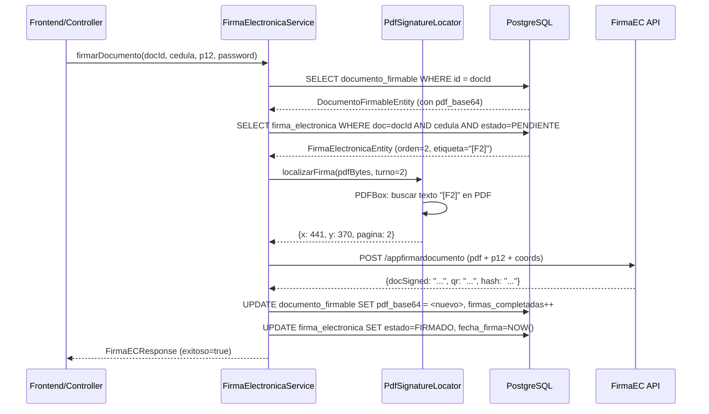

# Plan Estratégico: Librería Genérica de Firma Electrónica con Etiquetas de Anclaje

**Fecha:** Mayo 2026  
**Proyecto:** MICV1 (`gestion_publicaciones`) — Spring Boot 4.0.5 / Java 21 / PostgreSQL 16  
**Sistema de Referencia:** SISPP_EAR (JEE/EJB — `PDFTextLocationFinder` + `GestorFirmaService`)  
**Objetivo:** Crear un servicio de firma electrónica reutilizable que NO requiera crear clases de estrategia Java por cada nuevo JRXML.

---

## Tabla de Contenido

1. [Diagnóstico del Sistema Legacy (SISPP)](#1-diagnóstico-del-sistema-legacy-sispp)
2. [Diseño de la Solución Genérica](#2-diseño-de-la-solución-genérica)
3. [Convención JRXML: Etiquetas de Anclaje](#3-convención-jrxml-etiquetas-de-anclaje)
4. [Diseño de Base de Datos](#4-diseño-de-base-de-datos)
5. [Arquitectura Spring Boot](#5-arquitectura-spring-boot)
6. [Código de Referencia Completo](#6-código-de-referencia-completo)
7. [Integración con FirmaEC API](#7-integración-con-firmaec-api)
8. [Migración Flyway](#8-migración-flyway)
9. [Flujo Completo de Firma (Secuencia)](#9-flujo-completo-de-firma-secuencia)
10. [Inventario de JRXMLs y Etiquetas Necesarias](#10-inventario-de-jrxmls-y-etiquetas-necesarias)
11. [Plan de Ejecución por Fases](#11-plan-de-ejecución-por-fases)
12. [Riesgos y Mitigaciones](#12-riesgos-y-mitigaciones)

---

## 1. Diagnóstico del Sistema Legacy (SISPP)

### 1.1 Problema Actual
El sistema SISPP usa **12 clases de estrategia** Java diferentes para calcular coordenadas de firma en PDFs. Cada clase contiene heurísticas de posición (reglas como "si `X < 280` y el `Y` es el mayor...") que son:

- **Frágiles**: Un cambio de diseño en el JRXML rompe la lógica de posicionamiento.
- **No escalables**: Cada nuevo reporte requiere escribir una nueva clase Java.
- **Ambiguas**: Todas las firmas usan la misma etiqueta `"CI:"`, por lo que el sistema debe "adivinar" cuál CI corresponde a cuál firmante basándose en posición espacial X/Y.

### 1.2 Clases de Estrategia Existentes (12 archivos)

| Clase | Documento | Turnos | Problema |
|-------|-----------|--------|----------|
| `EstrategiaFirmaInforme` | `informe.jrxml` | 3 | Heurística por columna izq/der |
| `EstrategiaFirmaSolicitud` | `solicitud.jrxml` | 3 | Heurística por columna izq/der |
| `EstrategiaFirmaHoja` | Hoja de Cálculo | 2-3 | Agrupa por "banda inferior" |
| `EstrategiaFirmaMemo` | Memo de Pago | 4 | Lógica de 4 bandas |
| `EstrategiaFirmaOficio` | Oficio de Pago | 2 (×2) | Doble estampado por persona |
| `EstrategiaFirmaFacturaPersona` | Factura | 1 | Busca el único CI |
| `EstrategiaFirmaReporteOper` | Reporte Operación | 2 | Derecha/Izquierda |
| `EstrategiaFirmaValidacion` | Validación Legacy | 3 | 3 bandas Y |
| `EstrategiaFirmaValidacionMemo` | Validación Memo | 3 (×2) | Doble estampado |
| `EstrategiaFirmaValidacionListado` | Validación Listado | 3 | Igual a Validación |
| `EstrategiaCoordenadasFirma` | Interface | — | Contrato |
| `EstrategiaCoordenadasFirmaDoble` | Interface Doble | — | Contrato extendido |

### 1.3 Lo que SÍ funciona bien y se debe reutilizar
- **`PDFTextLocationFinder`**: El escáner de texto de PDFBox es robusto. Su lógica de:
  1. Buscar texto en el PDF renderizado
  2. Obtener coordenadas `[X, Y, página]`  
  3. Convertir de sistema PDFBox (`Y↓`) a sistema PDF estándar (`Y↑`)
  
  **Es 100% reutilizable.** Solo debemos cambiar lo que busca: en vez de `"CI:"` genérico, buscar `"[F1]"`, `"[F2]"`, etc.

- **`FirmasECClientBeanExtended`**: La integración HTTP con FirmaEC API (JWT + appfirmardocumento) es funcional. Solo se necesita portar de `HttpURLConnection` a Spring `RestTemplate`/`WebClient`.

---

## 2. Diseño de la Solución Genérica

### 2.1 Principio Central

> **"Una etiqueta única por firmante en el JRXML = Cero clases de estrategia Java"**

En lugar de buscar `"CI:"` (que aparece N veces y obliga a "adivinar"), el JRXML incluirá etiquetas de anclaje únicas como `[F1]`, `[F2]`, `[F3]`, etc.

El sistema simplemente busca `"[F" + turnoFirma + "]"` en el PDF y obtiene la coordenada exacta. **Un solo método genérico para TODOS los documentos.**

### 2.2 Diagrama de Arquitectura

```
┌───────────────────────────────────────────────────────────────┐
│                    MICV1 (Spring Boot)                        │
│                                                               │
│  ┌─────────────┐     ┌──────────────────┐     ┌───────────┐  │
│  │ Controller   │────▶│ FirmaService     │────▶│ FirmaEC   │  │
│  │ (REST API)   │     │ (Orquestación)   │     │ Client    │  │
│  └─────────────┘     └────────┬─────────┘     └───────────┘  │
│                               │                               │
│                    ┌──────────▼──────────┐                    │
│                    │ PdfSignatureLocator │                    │
│                    │ (PDFBox Scanner)    │                    │
│                    │ Busca "[F1]","[F2]" │                    │
│                    └────────────────────┘                     │
│                               │                               │
│                    ┌──────────▼──────────┐                    │
│                    │  PostgreSQL         │                    │
│                    │  firmas_electronicas│                    │
│                    │  documentos_firmable│                    │
│                    └────────────────────┘                     │
└───────────────────────────────────────────────────────────────┘
```

### 2.3 Comparación: Sistema Legacy vs. Solución Propuesta

| Aspecto | SISPP Legacy | MICV1 Propuesto |
|---------|-------------|-----------------|
| Búsqueda en PDF | `"CI:"` (ambiguo) | `"[F1]"`, `"[F2]"` (único) |
| Clases Java por documento | 1 por cada JRXML | **0** (genérico) |
| Agregar nuevo documento | Crear clase + registrar en switch | Solo diseñar JRXML con `[FN]` |
| Persistencia | Columnas estáticas `firmante1..4` | Tabla normalizada maestro-detalle |
| Framework | JEE/EJB | Spring Boot |
| Cliente HTTP FirmaEC | `HttpURLConnection` | Spring `RestTemplate` |

---

## 3. Convención JRXML: Etiquetas de Anclaje

### 3.1 Regla Estándar

En cada sección de firma del JRXML, junto a la cédula del firmante, se debe agregar un `staticText` o `textField` con el texto **`[FN]`** donde `N` es el turno de firma (1, 2, 3...).

### 3.2 Formato de la Etiqueta

```
[F1]  →  Primer firmante  (ej: "Realizado por" / "Comisionado")
[F2]  →  Segundo firmante (ej: "Revisado por" / "Jefe de Grupo")
[F3]  →  Tercer firmante  (ej: "Aprobado por" / "Autoridad")
[F4]  →  Cuarto firmante  (si aplica)
```

### 3.3 Ejemplo en JRXML: Sección de Firmas de `solicitudFondos.jrxml`

Antes (actual, sin etiquetas):
```xml
<!-- Fila "Realizado por" — solo tiene nombre, cédula, cargo y celda vacía de firma -->
<textField>
    <reportElement x="187" y="20" width="127" height="50"/>
    <textFieldExpression><![CDATA[$P{P_REALIZADO_CI}]]></textFieldExpression>
</textField>
<staticText>
    <reportElement x="441" y="20" width="114" height="50"/>
    <text><![CDATA[]]></text>  <!-- Espacio vacío para firma manuscrita -->
</staticText>
```

Después (con etiqueta de anclaje):
```xml
<!-- Fila "Realizado por" — ahora la celda de firma tiene [F1] -->
<textField>
    <reportElement x="187" y="20" width="127" height="50"/>
    <textFieldExpression><![CDATA[$P{P_REALIZADO_CI}]]></textFieldExpression>
</textField>
<staticText>
    <reportElement x="441" y="20" width="114" height="50"/>
    <box><pen lineWidth="0.5"/></box>
    <textElement textAlignment="Center" verticalAlignment="Top">
        <font fontName="Arial Narrow" size="6" pdfFontName="Helvetica"
              forecolor="#FFFFFF"/>  <!-- Color blanco: invisible en impresión -->
    </textElement>
    <text><![CDATA[[F1]]]></text>  <!-- Etiqueta de anclaje para Firma Turno 1 -->
</staticText>
```

> **NOTA IMPORTANTE sobre visibilidad**: La etiqueta `[F1]` se puede hacer "invisible" visualmente de dos maneras:
> 1. **Color blanco** (`forecolor="#FFFFFF"` sobre fondo blanco) — Recomendado. El texto existe en la capa de texto del PDF pero no se ve impreso.
> 2. **Tamaño microscópico** (`size="1"`) — Alternativa si el fondo no es blanco.
> 
> **NO usar `mode="Opaque"` con `backcolor` que tape la etiqueta**. El escáner PDFBox lee la capa de texto, no los píxeles. El texto debe existir en el flujo de caracteres del PDF.

### 3.4 Consideración: Doble Estampado (Oficio)

Para documentos como el Oficio donde una persona firma en **2 posiciones**, usamos sub-índices:

```
[F1A]  →  Primera firma de la Persona 1 (izquierda)
[F1B]  →  Segunda firma de la Persona 1 (derecha)
[F2A]  →  Primera firma de la Persona 2 (izquierda)
[F2B]  →  Segunda firma de la Persona 2 (derecha)
```

El servicio detecta si existe `[FNA]` y `[FNB]` automáticamente y aplica doble estampado.

---

## 4. Diseño de Base de Datos

### 4.1 Esquema: `publicaciones` (mismo esquema del proyecto MICV1)

Se crean 2 tablas nuevas que se integran con las existentes:

```
┌─────────────────────────────┐     ┌─────────────────────────────┐
│   documentos_firmables      │     │   firmas_electronicas       │
│   (Maestro)                 │     │   (Detalle)                 │
├─────────────────────────────┤     ├─────────────────────────────┤
│ PK id_documento_firmable    │◄────│ FK id_documento_firmable    │
│ FK id_solicitud (nullable)  │     │ PK id_firma_electronica     │
│ FK id_tipo_documento        │     │    orden_firma (1,2,3...)   │
│    pdf_base64 (TEXT)        │     │    cedula_firmante          │
│    nombre_archivo           │     │    estado (PENDIENTE|       │
│    total_firmas_requeridas  │     │            FIRMADO|OMITIDO) │
│    firmas_completadas       │     │    fecha_firma              │
│    estado (PENDIENTE|       │     │    hash_firma               │
│            EN_PROCESO|      │     │    qr_base64                │
│            COMPLETADO)      │     │    coordenada_x             │
│    created_at               │     │    coordenada_y             │
│    updated_at               │     │    pagina_firma             │
└─────────────────────────────┘     │    etiqueta_ancla ("[F1]")  │
         ▲                          │    created_at               │
         │                          └─────────────────────────────┘
         │
   ┌─────┴───────────────┐
   │  solicitudes         │  (tabla existente en MICV1)
   │  PK id_solicitud     │
   └─────────────────────┘
```

### 4.2 Relación con tablas existentes de MICV1

- `documentos_firmables` se enlaza opcionalmente a `publicaciones.solicitudes` (por `id_solicitud`) para saber a qué trámite pertenece el documento firmable.
- `documentos_firmables` se enlaza a `publicaciones.tipos_documento` (catálogo existente) para identificar si es "Solicitud de Fondos", "Orden de Gasto", "Informe de Evaluación", etc.
- `firmas_electronicas` es la tabla detalle con un registro por cada firmante requerido.
- **NO se reutiliza `firmas_documento`** (tabla existente V6) porque esa tabla tiene un diseño diferente: registra firmas como actos aislados sin concepto de turno, y no tiene `pdf_base64`.

### 4.3 Comparación con la tabla `sfir_firmas` de SISPP

| Campo SISPP (`sfir_firmas`) | Campo MICV1 (`documentos_firmables`) | Nota |
|---|---|---|
| `fir_secuen` (PK) | `id_documento_firmable` (PK) | Auto-incremental |
| `cms_secuen` (FK operación) | `id_solicitud` (FK solicitudes) | Relación al trámite padre |
| `cat_secuen` (FK catálogo) | `id_tipo_documento` (FK tipos_documento) | Tipo de documento |
| `fir_base64` (TEXT) | `pdf_base64` (TEXT) | PDF acumulado en Base64 |
| `fir_numfir` (INTEGER) | `firmas_completadas` (INTEGER) | Contador de firmas realizadas |
| `fir_estado` (CHAR) | `estado` (VARCHAR) | "PENDIENTE" / "EN_PROCESO" / "COMPLETADO" |
| `fir_cedula1..4` (VARCHAR) | **Tabla `firmas_electronicas`** | Normalizado a N filas |
| `fir_fecha1..4` (TIMESTAMP) | **Tabla `firmas_electronicas`** | Normalizado a N filas |

**Ventaja clave**: En SISPP, la tabla tiene columnas fijas (`cedula1`, `cedula2`, `cedula3`, `cedula4`), lo que limita a 4 firmantes máximo. En MICV1, la tabla `firmas_electronicas` es una tabla detalle sin límite de firmantes.

---

## 5. Arquitectura Spring Boot

### 5.1 Paquete Propuesto

```
ec.edu.espe.gestion_publicaciones.firmaec/
├── controller/
│   └── FirmaElectronicaController.java     ← REST API endpoints
├── model/
│   ├── entity/
│   │   ├── DocumentoFirmableEntity.java    ← JPA Entity maestro
│   │   └── FirmaElectronicaEntity.java     ← JPA Entity detalle
│   └── dto/
│       ├── CrearDocumentoFirmableRequest.java
│       ├── FirmarDocumentoRequest.java
│       ├── DocumentoFirmableResponse.java
│       └── FirmaElectronicaResponse.java
├── repository/
│   ├── DocumentoFirmableRepository.java
│   └── FirmaElectronicaRepository.java
├── service/
│   ├── FirmaElectronicaService.java        ← Orquestación principal
│   └── PdfSignatureLocator.java            ← Scanner genérico (port de PDFTextLocationFinder)
├── integration/
│   ├── FirmaECClient.java                  ← Cliente HTTP para FirmaEC API
│   ├── FirmaECProperties.java              ← @ConfigurationProperties
│   └── FirmaECResponse.java                ← DTO de respuesta
├── mapper/
│   └── FirmaElectronicaMapper.java
└── package-info.java
```

### 5.2 Dependencia Adicional en `pom.xml`

```xml
<!-- Apache PDFBox para escanear texto en PDFs -->
<dependency>
    <groupId>org.apache.pdfbox</groupId>
    <artifactId>pdfbox</artifactId>
    <version>3.0.4</version>
</dependency>

<!-- JSON para parsear respuestas de FirmaEC -->
<dependency>
    <groupId>org.json</groupId>
    <artifactId>json</artifactId>
    <version>20240303</version>
</dependency>
```

---

## 6. Código de Referencia Completo

### 6.1 `PdfSignatureLocator.java` — El Escáner Genérico

Este es el **corazón de la librería**. Port de `PDFTextLocationFinder` adaptado a Spring Boot y a la convención de etiquetas `[FN]`.

```java
package ec.edu.espe.gestion_publicaciones.firmaec.service;

import org.apache.pdfbox.pdmodel.PDDocument;
import org.apache.pdfbox.pdmodel.PDPage;
import org.apache.pdfbox.pdmodel.common.PDRectangle;
import org.apache.pdfbox.text.PDFTextStripper;
import org.apache.pdfbox.text.TextPosition;
import org.springframework.stereotype.Component;

import java.io.ByteArrayInputStream;
import java.io.IOException;
import java.util.ArrayList;
import java.util.List;

/**
 * Escáner genérico de posiciones de firma en PDFs.
 *
 * Busca etiquetas de anclaje únicas como "[F1]", "[F2]", "[F3]" dentro del
 * flujo de texto del PDF renderizado y devuelve las coordenadas físicas
 * exactas (X, Y, Página) en el sistema de coordenadas PDF estándar
 * (origen abajo-izquierda).
 *
 * REUTILIZA la lógica probada de PDFTextLocationFinder de SISPP,
 * pero elimina la necesidad de heurísticas de posición por columna.
 */
@Component
public class PdfSignatureLocator {

    /**
     * Busca la etiqueta "[FN]" en el PDF y devuelve sus coordenadas.
     *
     * @param pdfBytes   PDF en bytes
     * @param turnoFirma Turno del firmante (1, 2, 3...)
     * @return int[] {x, y, pagina} o null si no se encuentra
     */
    public int[] localizarFirma(byte[] pdfBytes, int turnoFirma) {
        return localizarFirma(pdfBytes, turnoFirma, null);
    }

    /**
     * Busca la etiqueta "[FN]" o "[FNA]"/"[FNB]" para doble estampado.
     *
     * @param pdfBytes    PDF en bytes
     * @param turnoFirma  Turno del firmante (1, 2, 3...)
     * @param subIndice   null para simple, "A" o "B" para doble estampado
     * @return int[] {x, y, pagina} o null si no se encuentra
     */
    public int[] localizarFirma(byte[] pdfBytes, int turnoFirma, String subIndice) {
        String etiqueta = subIndice != null
                ? "[F" + turnoFirma + subIndice + "]"
                : "[F" + turnoFirma + "]";

        float[] coords = findTextCoordinates(pdfBytes, etiqueta);
        if (coords != null) {
            int offsetY = 15; // Offset calibrado para centrar QR sobre la etiqueta
            return new int[]{
                (int) coords[0],
                (int) (coords[1] + offsetY),
                (int) coords[2]
            };
        }
        return null;
    }

    /**
     * Detecta si un documento usa doble estampado para un turno dado.
     * (Verifica la existencia de "[FNA]" y "[FNB]")
     */
    public boolean esDobleEstampado(byte[] pdfBytes, int turnoFirma) {
        String etiquetaA = "[F" + turnoFirma + "A]";
        String etiquetaB = "[F" + turnoFirma + "B]";
        return findTextCoordinates(pdfBytes, etiquetaA) != null
            && findTextCoordinates(pdfBytes, etiquetaB) != null;
    }

    /**
     * Detecta cuántas etiquetas de firma existen en el PDF.
     * Busca [F1], [F2], [F3]... hasta que no encuentre más.
     */
    public int detectarTotalFirmas(byte[] pdfBytes) {
        int total = 0;
        for (int i = 1; i <= 10; i++) {
            String etiqueta = "[F" + i + "]";
            String etiquetaA = "[F" + i + "A]";
            if (findTextCoordinates(pdfBytes, etiqueta) != null
                || findTextCoordinates(pdfBytes, etiquetaA) != null) {
                total = i;
            } else {
                break;
            }
        }
        return total;
    }

    // =====================================================================
    //  LÓGICA INTERNA (Port de PDFTextLocationFinder de SISPP)
    // =====================================================================

    private float[] findTextCoordinates(byte[] pdfBytes, String searchText) {
        try (PDDocument document = PDDocument.load(new ByteArrayInputStream(pdfBytes))) {
            int totalPages = document.getNumberOfPages();

            for (int pageNum = 0; pageNum < totalPages; pageNum++) {
                PDPage page = document.getPage(pageNum);
                PDRectangle mediaBox = page.getMediaBox();
                float pageHeight = mediaBox.getHeight();

                TextPositionExtractor extractor =
                    new TextPositionExtractor(document, pageNum, searchText);
                extractor.extractTextPositions();

                if (extractor.foundPosition != null) {
                    float x = extractor.foundPosition.getX();
                    float y = extractor.foundPosition.getY();
                    float pdfY = pageHeight - y; // Conversión PDFBox → PDF estándar

                    return new float[]{x, pdfY, pageNum + 1};
                }
            }
        } catch (IOException e) {
            // Log error pero no lanzar excepción
            System.err.println("PdfSignatureLocator: Error escaneando PDF - " + e.getMessage());
        }
        return null;
    }

    /**
     * Clase interna que extiende PDFTextStripper para interceptar
     * las posiciones de cada carácter renderizado.
     */
    private static class TextPositionExtractor extends PDFTextStripper {
        private final String searchText;
        private final StringBuilder currentLine = new StringBuilder();
        private final List<TextPosition> currentPositions = new ArrayList<>();
        TextPosition foundPosition = null;

        TextPositionExtractor(PDDocument document, int pageNum, String searchText)
                throws IOException {
            super();
            this.document = document;
            this.searchText = searchText;
            this.setStartPage(pageNum + 1);
            this.setEndPage(pageNum + 1);
        }

        void extractTextPositions() throws IOException {
            this.getText(document);
        }

        @Override
        protected void writeString(String string, List<TextPosition> textPositions)
                throws IOException {
            for (TextPosition tp : textPositions) {
                currentLine.append(tp.getUnicode());
                currentPositions.add(tp);
            }

            String line = currentLine.toString();
            int idx = line.indexOf(searchText);
            if (idx >= 0 && foundPosition == null) {
                foundPosition = currentPositions.get(idx);
            }
        }

        @Override
        protected void writeLineSeparator() throws IOException {
            currentLine.setLength(0);
            currentPositions.clear();
            super.writeLineSeparator();
        }
    }
}
```

### 6.2 `DocumentoFirmableEntity.java` — Entidad Maestro

```java
package ec.edu.espe.gestion_publicaciones.firmaec.model.entity;

import ec.edu.espe.gestion_publicaciones.catalogos.model.entity.TipoDocumentoEntity;
import ec.edu.espe.gestion_publicaciones.solicitudes.model.entity.SolicitudEntity;
import jakarta.persistence.*;
import lombok.Getter;
import lombok.Setter;

import java.time.LocalDateTime;
import java.util.ArrayList;
import java.util.List;

@Getter
@Setter
@Entity
@Table(name = "documentos_firmables", schema = "publicaciones")
public class DocumentoFirmableEntity {

    @Id
    @GeneratedValue(strategy = GenerationType.IDENTITY)
    @Column(name = "id_documento_firmable")
    private Long id;

    @ManyToOne(fetch = FetchType.LAZY)
    @JoinColumn(name = "id_solicitud")
    private SolicitudEntity solicitud;

    @ManyToOne(fetch = FetchType.LAZY)
    @JoinColumn(name = "id_tipo_documento", nullable = false)
    private TipoDocumentoEntity tipoDocumento;

    @Column(name = "pdf_base64", columnDefinition = "TEXT")
    private String pdfBase64;

    @Column(name = "nombre_archivo", length = 255)
    private String nombreArchivo;

    @Column(name = "total_firmas_requeridas", nullable = false)
    private int totalFirmasRequeridas;

    @Column(name = "firmas_completadas", nullable = false)
    private int firmasCompletadas = 0;

    @Column(name = "estado", nullable = false, length = 30)
    private String estado = "PENDIENTE";

    @OneToMany(mappedBy = "documentoFirmable", cascade = CascadeType.ALL,
               orphanRemoval = true, fetch = FetchType.LAZY)
    @OrderBy("ordenFirma ASC")
    private List<FirmaElectronicaEntity> firmas = new ArrayList<>();

    @Column(name = "created_at", nullable = false)
    private LocalDateTime createdAt;

    @Column(name = "updated_at", nullable = false)
    private LocalDateTime updatedAt;

    @PrePersist
    void prePersist() {
        var now = LocalDateTime.now();
        this.createdAt = now;
        this.updatedAt = now;
    }

    @PreUpdate
    void preUpdate() {
        this.updatedAt = LocalDateTime.now();
    }
}
```

### 6.3 `FirmaElectronicaEntity.java` — Entidad Detalle

```java
package ec.edu.espe.gestion_publicaciones.firmaec.model.entity;

import jakarta.persistence.*;
import lombok.Getter;
import lombok.Setter;

import java.time.LocalDateTime;

@Getter
@Setter
@Entity
@Table(name = "firmas_electronicas", schema = "publicaciones",
       uniqueConstraints = @UniqueConstraint(
           columnNames = {"id_documento_firmable", "orden_firma"}))
public class FirmaElectronicaEntity {

    @Id
    @GeneratedValue(strategy = GenerationType.IDENTITY)
    @Column(name = "id_firma_electronica")
    private Long id;

    @ManyToOne(fetch = FetchType.LAZY)
    @JoinColumn(name = "id_documento_firmable", nullable = false)
    private DocumentoFirmableEntity documentoFirmable;

    @Column(name = "orden_firma", nullable = false)
    private int ordenFirma;

    @Column(name = "cedula_firmante", nullable = false, length = 15)
    private String cedulaFirmante;

    @Column(name = "nombre_firmante", length = 200)
    private String nombreFirmante;

    @Column(name = "rol_firma", length = 100)
    private String rolFirma; // "REALIZADO_POR", "REVISADO_POR", "APROBADO_POR"

    @Column(name = "estado", nullable = false, length = 20)
    private String estado = "PENDIENTE"; // PENDIENTE, FIRMADO, OMITIDO

    @Column(name = "fecha_firma")
    private LocalDateTime fechaFirma;

    @Column(name = "hash_firma", length = 256)
    private String hashFirma;

    @Column(name = "qr_base64", columnDefinition = "TEXT")
    private String qrBase64;

    @Column(name = "etiqueta_ancla", length = 10)
    private String etiquetaAncla; // "[F1]", "[F2]", "[F1A]", etc.

    @Column(name = "coordenada_x")
    private Integer coordenadaX;

    @Column(name = "coordenada_y")
    private Integer coordenadaY;

    @Column(name = "pagina_firma")
    private Integer paginaFirma;

    @Column(name = "created_at", nullable = false)
    private LocalDateTime createdAt;

    @PrePersist
    void prePersist() {
        this.createdAt = LocalDateTime.now();
    }
}
```

### 6.4 `FirmaElectronicaService.java` — Orquestación Central

```java
package ec.edu.espe.gestion_publicaciones.firmaec.service;

import ec.edu.espe.gestion_publicaciones.firmaec.integration.FirmaECClient;
import ec.edu.espe.gestion_publicaciones.firmaec.integration.FirmaECResponse;
import ec.edu.espe.gestion_publicaciones.firmaec.model.entity.DocumentoFirmableEntity;
import ec.edu.espe.gestion_publicaciones.firmaec.model.entity.FirmaElectronicaEntity;
import ec.edu.espe.gestion_publicaciones.firmaec.repository.DocumentoFirmableRepository;
import ec.edu.espe.gestion_publicaciones.firmaec.repository.FirmaElectronicaRepository;
import lombok.RequiredArgsConstructor;
import org.springframework.stereotype.Service;
import org.springframework.transaction.annotation.Transactional;

import java.time.LocalDateTime;
import java.util.Base64;

@Service
@RequiredArgsConstructor
public class FirmaElectronicaService {

    private final DocumentoFirmableRepository documentoRepo;
    private final FirmaElectronicaRepository firmaRepo;
    private final PdfSignatureLocator signatureLocator;
    private final FirmaECClient firmaECClient;

    /**
     * MÉTODO CENTRAL: Firma el documento para el siguiente turno pendiente.
     *
     * Flujo:
     * 1. Recupera el documento firmable y su PDF acumulado de la BD.
     * 2. Busca la firma pendiente del usuario.
     * 3. Escanea el PDF buscando la etiqueta de anclaje "[FN]".
     * 4. Envía el PDF + coordenadas a FirmaEC.
     * 5. Persiste el PDF firmado de vuelta en la BD.
     *
     * NO necesita saber qué tipo de documento es. La etiqueta en el PDF
     * es suficiente para posicionar la firma.
     */
    @Transactional
    public FirmaECResponse firmarDocumento(Long documentoFirmableId,
                                            String cedulaUsuario,
                                            byte[] p12Bytes,
                                            String password) {

        // 1. Cargar documento firmable
        DocumentoFirmableEntity doc = documentoRepo.findById(documentoFirmableId)
            .orElseThrow(() -> new RuntimeException(
                "Documento firmable no encontrado: " + documentoFirmableId));

        if ("COMPLETADO".equals(doc.getEstado())) {
            throw new RuntimeException("El documento ya fue completamente firmado.");
        }

        // 2. Buscar la firma pendiente del usuario
        FirmaElectronicaEntity firmaPendiente = firmaRepo
            .findByDocumentoFirmableIdAndCedulaFirmanteAndEstado(
                documentoFirmableId, cedulaUsuario, "PENDIENTE")
            .orElseThrow(() -> new RuntimeException(
                "No hay firma pendiente para cédula: " + cedulaUsuario));

        // 3. Decodificar PDF actual
        byte[] pdfBytes = Base64.getDecoder().decode(doc.getPdfBase64());
        int turno = firmaPendiente.getOrdenFirma();

        // 4. Detectar si es doble estampado o simple
        boolean doble = signatureLocator.esDobleEstampado(pdfBytes, turno);

        FirmaECResponse response;

        if (doble) {
            // === DOBLE ESTAMPADO ===
            int[] coordsA = signatureLocator.localizarFirma(pdfBytes, turno, "A");
            if (coordsA == null) {
                throw new RuntimeException(
                    "No se encontró etiqueta [F" + turno + "A] en el PDF.");
            }

            // Primera firma
            response = firmaECClient.firmar(
                pdfBytes, p12Bytes, password, cedulaUsuario,
                coordsA[0], coordsA[1], coordsA[2]);

            if (response.isExitoso()) {
                // Segunda firma sobre el PDF intermedio
                byte[] pdfIntermedio = response.getDocumentoFirmado();
                int[] coordsB = signatureLocator.localizarFirma(pdfIntermedio, turno, "B");
                if (coordsB == null) {
                    throw new RuntimeException(
                        "No se encontró etiqueta [F" + turno + "B] en el PDF.");
                }
                response = firmaECClient.firmar(
                    pdfIntermedio, p12Bytes, password, cedulaUsuario,
                    coordsB[0], coordsB[1], coordsB[2]);
            }
        } else {
            // === ESTAMPADO SIMPLE ===
            int[] coords = signatureLocator.localizarFirma(pdfBytes, turno);
            if (coords == null) {
                throw new RuntimeException(
                    "No se encontró etiqueta [F" + turno + "] en el PDF.");
            }

            response = firmaECClient.firmar(
                pdfBytes, p12Bytes, password, cedulaUsuario,
                coords[0], coords[1], coords[2]);
        }

        // 5. Persistir resultado
        if (response.isExitoso()) {
            // Actualizar PDF acumulado en maestro
            String base64Firmado = Base64.getEncoder()
                .encodeToString(response.getDocumentoFirmado());
            doc.setPdfBase64(base64Firmado);
            doc.setFirmasCompletadas(doc.getFirmasCompletadas() + 1);

            if (doc.getFirmasCompletadas() >= doc.getTotalFirmasRequeridas()) {
                doc.setEstado("COMPLETADO");
            } else {
                doc.setEstado("EN_PROCESO");
            }
            documentoRepo.save(doc);

            // Actualizar registro de firma individual
            firmaPendiente.setEstado("FIRMADO");
            firmaPendiente.setFechaFirma(LocalDateTime.now());
            firmaPendiente.setHashFirma(response.getHashFirma());
            firmaPendiente.setQrBase64(response.getQrImageBase64());
            firmaRepo.save(firmaPendiente);
        }

        return response;
    }

    /**
     * Crea un documento firmable con su cadena de firmas definida.
     */
    @Transactional
    public DocumentoFirmableEntity crearDocumentoFirmable(
            Long idSolicitud,
            Long idTipoDocumento,
            byte[] pdfBytes,
            String nombreArchivo,
            FirmanteInfo... firmantes) {

        DocumentoFirmableEntity doc = new DocumentoFirmableEntity();
        // Se deja la asignación de solicitud y tipoDocumento al caller
        doc.setPdfBase64(Base64.getEncoder().encodeToString(pdfBytes));
        doc.setNombreArchivo(nombreArchivo);
        doc.setTotalFirmasRequeridas(firmantes.length);
        doc.setEstado("PENDIENTE");

        for (int i = 0; i < firmantes.length; i++) {
            FirmaElectronicaEntity firma = new FirmaElectronicaEntity();
            firma.setDocumentoFirmable(doc);
            firma.setOrdenFirma(i + 1);
            firma.setCedulaFirmante(firmantes[i].cedula());
            firma.setNombreFirmante(firmantes[i].nombre());
            firma.setRolFirma(firmantes[i].rol());
            firma.setEtiquetaAncla("[F" + (i + 1) + "]");
            firma.setEstado("PENDIENTE");
            doc.getFirmas().add(firma);
        }

        return documentoRepo.save(doc);
    }

    // Record auxiliar
    public record FirmanteInfo(String cedula, String nombre, String rol) {}
}
```

### 6.5 `FirmaECClient.java` — Cliente HTTP para FirmaEC

```java
package ec.edu.espe.gestion_publicaciones.firmaec.integration;

import lombok.RequiredArgsConstructor;
import org.json.JSONArray;
import org.json.JSONObject;
import org.springframework.http.*;
import org.springframework.stereotype.Component;
import org.springframework.util.LinkedMultiValueMap;
import org.springframework.util.MultiValueMap;
import org.springframework.web.client.RestTemplate;

import java.util.Base64;

/**
 * Cliente HTTP para la API REST de FirmaEC.
 *
 * Port del legacy FirmasECClientBeanExtended de SISPP,
 * adaptado a Spring RestTemplate.
 */
@Component
@RequiredArgsConstructor
public class FirmaECClient {

    private final FirmaECProperties props;
    private final RestTemplate restTemplate;

    /**
     * Firma un documento PDF con coordenadas específicas.
     */
    public FirmaECResponse firmar(byte[] pdfBytes, byte[] p12Bytes,
                                   String password, String cedula,
                                   int qrX, int qrY, int qrPage) {

        FirmaECResponse response = new FirmaECResponse();

        try {
            // 1. Obtener JWT
            String jwt = obtenerJWT();
            if (jwt == null) {
                response.setMensajeError("No se pudo obtener token JWT de FirmaEC");
                return response;
            }

            // 2. Preparar payload
            String documentoBase64 = Base64.getEncoder().encodeToString(pdfBytes);
            String certificadoBase64 = Base64.getEncoder().encodeToString(p12Bytes);
            String passwordBase64 = Base64.getEncoder()
                .encodeToString(password.getBytes("UTF-8"));

            JSONObject systemInfo = new JSONObject();
            systemInfo.put("sistemaOperativo", System.getProperty("os.name"));
            systemInfo.put("aplicacion", "MICV1-FirmaEC");
            systemInfo.put("versionApp", "1.0.0");
            String systemInfoBase64 = Base64.getEncoder()
                .encodeToString(systemInfo.toString().getBytes("UTF-8"));

            JSONObject jsonConfig = new JSONObject();
            jsonConfig.put("versionFirmaEC", props.getVersion());
            jsonConfig.put("formatoDocumento", "pdf");
            jsonConfig.put("llx", String.valueOf(qrX));
            jsonConfig.put("lly", String.valueOf(qrY));
            jsonConfig.put("pagina", String.valueOf(qrPage));
            jsonConfig.put("tipoEstampado", "QR");
            jsonConfig.put("razon", "Firma Electrónica - MICV1");

            // 3. Enviar a FirmaEC
            HttpHeaders headers = new HttpHeaders();
            headers.setContentType(MediaType.APPLICATION_FORM_URLENCODED);

            MultiValueMap<String, String> body = new LinkedMultiValueMap<>();
            body.add("jwt", jwt);
            body.add("pkcs12", certificadoBase64);
            body.add("password", passwordBase64);
            body.add("documento", documentoBase64);
            body.add("json", jsonConfig.toString());
            body.add("base64", systemInfoBase64);

            HttpEntity<MultiValueMap<String, String>> request =
                new HttpEntity<>(body, headers);

            ResponseEntity<String> httpResponse = restTemplate.postForEntity(
                props.getBaseUrl() + "/appfirmardocumento",
                request, String.class);

            // 4. Parsear respuesta
            if (httpResponse.getStatusCode() == HttpStatus.OK) {
                JSONArray jsonArray = new JSONArray(httpResponse.getBody());
                if (jsonArray.length() > 0) {
                    JSONObject resultado = jsonArray.getJSONObject(0);

                    if (resultado.has("error") && !resultado.isNull("error")) {
                        response.setMensajeError(resultado.getString("error"));
                        return response;
                    }

                    if (resultado.has("docSigned")) {
                        response.setDocumentoFirmado(
                            Base64.getDecoder().decode(resultado.getString("docSigned")));
                    }
                    if (resultado.has("qrImage")) {
                        response.setQrImageBase64(resultado.getString("qrImage"));
                    } else if (resultado.has("qr")) {
                        response.setQrImageBase64(resultado.getString("qr"));
                    }
                    if (resultado.has("hash")) {
                        response.setHashFirma(resultado.getString("hash"));
                    }

                    response.setExitoso(true);
                }
            } else {
                response.setMensajeError("HTTP " + httpResponse.getStatusCode());
            }

        } catch (Exception e) {
            response.setMensajeError("Excepción: " + e.getMessage());
        }

        return response;
    }

    private String obtenerJWT() {
        try {
            HttpHeaders headers = new HttpHeaders();
            headers.setContentType(MediaType.APPLICATION_FORM_URLENCODED);
            headers.set("X-API-KEY", props.getApiKey());

            JSONObject payload = new JSONObject();
            payload.put("sistemaTransversal", props.getSistema());
            String base64Payload = Base64.getEncoder()
                .encodeToString(payload.toString().getBytes("UTF-8"));

            MultiValueMap<String, String> body = new LinkedMultiValueMap<>();
            body.add("base64", base64Payload);

            HttpEntity<MultiValueMap<String, String>> request =
                new HttpEntity<>(body, headers);

            ResponseEntity<String> response = restTemplate.postForEntity(
                props.getBaseUrl() + "/getjwt", request, String.class);

            if (response.getStatusCode() == HttpStatus.OK) {
                JSONObject jsonResponse = new JSONObject(response.getBody());
                return jsonResponse.getString("response");
            }
        } catch (Exception e) {
            System.err.println("FirmaECClient: Error obteniendo JWT - " + e.getMessage());
        }
        return null;
    }
}
```

### 6.6 `FirmaECProperties.java` — Configuración

```java
package ec.edu.espe.gestion_publicaciones.firmaec.integration;

import lombok.Getter;
import lombok.Setter;
import org.springframework.boot.context.properties.ConfigurationProperties;
import org.springframework.stereotype.Component;

@Getter
@Setter
@Component
@ConfigurationProperties(prefix = "app.firmaec")
public class FirmaECProperties {
    private String baseUrl = "http://localhost:8180/servicio";
    private String apiKey = "";
    private String sistema = "micv1-system";
    private String version = "4.1.0";
}
```

Se añade en `application.yaml`:
```yaml
app:
  firmaec:
    base-url: ${FIRMAEC_BASE_URL:http://localhost:8180/servicio}
    api-key: ${FIRMAEC_API_KEY:}
    sistema: ${FIRMAEC_SISTEMA:micv1-system}
    version: ${FIRMAEC_VERSION:4.1.0}
```

---

## 7. Integración con FirmaEC API

### 7.1 Contrato de la API (Documentado desde SISPP)

| Endpoint | Método | Descripción |
|----------|--------|-------------|
| `/servicio/getjwt` | POST | Obtiene token JWT temporal. Header: `X-API-KEY` |
| `/servicio/appfirmardocumento` | POST | Firma el PDF con QR. Body: `jwt, pkcs12, password, documento, json, base64` |

### 7.2 Campos del JSON de Configuración (`jsonConfig`)

```json
{
  "versionFirmaEC": "4.1.0",
  "formatoDocumento": "pdf",
  "llx": "200",        // ← Coordenada X del QR
  "lly": "150",        // ← Coordenada Y del QR
  "pagina": "1",       // ← Número de página (-1 = última)
  "tipoEstampado": "QR",
  "razon": "Firma Electrónica - MICV1"
}
```

### 7.3 Respuesta Exitosa de FirmaEC

```json
[
  {
    "docSigned": "<base64 del PDF firmado>",
    "qrImage": "<base64 de la imagen QR>",
    "hash": "<SHA256 del documento firmado>"
  }
]
```

---

## 8. Migración Flyway

### 8.1 `V38__firmas_electronicas_modulo.sql`

```sql
-- ============================================================
-- Módulo de Firma Electrónica con Etiquetas de Anclaje
-- Esquema: publicaciones (existente en MICV1)
-- ============================================================

-- TABLA MAESTRO: Documento que requiere firmas
CREATE TABLE IF NOT EXISTS publicaciones.documentos_firmables (
    id_documento_firmable BIGSERIAL PRIMARY KEY,
    id_solicitud          BIGINT REFERENCES publicaciones.solicitudes(id_solicitud),
    id_tipo_documento     BIGINT NOT NULL
                          REFERENCES publicaciones.tipos_documento(id_tipo_documento),
    pdf_base64            TEXT,
    nombre_archivo        VARCHAR(255),
    total_firmas_requeridas INTEGER NOT NULL DEFAULT 1,
    firmas_completadas    INTEGER NOT NULL DEFAULT 0,
    estado                VARCHAR(30) NOT NULL DEFAULT 'PENDIENTE',
    created_at            TIMESTAMP NOT NULL DEFAULT CURRENT_TIMESTAMP,
    updated_at            TIMESTAMP NOT NULL DEFAULT CURRENT_TIMESTAMP
);

-- TABLA DETALLE: Cada firma individual
CREATE TABLE IF NOT EXISTS publicaciones.firmas_electronicas (
    id_firma_electronica  BIGSERIAL PRIMARY KEY,
    id_documento_firmable BIGINT NOT NULL
                          REFERENCES publicaciones.documentos_firmables(id_documento_firmable)
                          ON DELETE CASCADE,
    orden_firma           INTEGER NOT NULL,
    cedula_firmante       VARCHAR(15) NOT NULL,
    nombre_firmante       VARCHAR(200),
    rol_firma             VARCHAR(100),
    estado                VARCHAR(20) NOT NULL DEFAULT 'PENDIENTE',
    fecha_firma           TIMESTAMP,
    hash_firma            VARCHAR(256),
    qr_base64             TEXT,
    etiqueta_ancla        VARCHAR(10),
    coordenada_x          INTEGER,
    coordenada_y          INTEGER,
    pagina_firma          INTEGER,
    created_at            TIMESTAMP NOT NULL DEFAULT CURRENT_TIMESTAMP,

    CONSTRAINT uq_firma_orden UNIQUE (id_documento_firmable, orden_firma)
);

-- ÍNDICES
CREATE INDEX IF NOT EXISTS idx_doc_firmable_solicitud
    ON publicaciones.documentos_firmables(id_solicitud);
CREATE INDEX IF NOT EXISTS idx_doc_firmable_estado
    ON publicaciones.documentos_firmables(estado);
CREATE INDEX IF NOT EXISTS idx_firma_elec_documento
    ON publicaciones.firmas_electronicas(id_documento_firmable);
CREATE INDEX IF NOT EXISTS idx_firma_elec_cedula
    ON publicaciones.firmas_electronicas(cedula_firmante);
CREATE INDEX IF NOT EXISTS idx_firma_elec_estado
    ON publicaciones.firmas_electronicas(estado);
CREATE INDEX IF NOT EXISTS idx_firma_elec_cedula_estado
    ON publicaciones.firmas_electronicas(cedula_firmante, estado);
```

---

## 9. Flujo Completo de Firma (Secuencia)



---

## 10. Inventario de JRXMLs y Etiquetas Necesarias

### 10.1 Documentos Nuevos (word-to-jrxml)

| # | JRXML | Firmantes | Etiquetas a Insertar |
|---|-------|-----------|---------------------|
| 1 | `solicitudFondos.jrxml` | 2 (Realizado, Aprobado) | `[F1]` en celda "Firma" fila Realizado, `[F2]` en celda "Firma" fila Aprobado |
| 2 | `formatoTransferenciaExterior.jrxml` | Por analizar | Agregar `[FN]` según diseño |
| 3 | `ordenGasto.jrxml` | Por analizar | Agregar `[FN]` según diseño |
| 4 | `anexoFirmaDocente.jrxml` | Múltiples | Agregar `[FN]` según diseño |
| 5 | `informeCoorInvPagoPublicaciones.jrxml` | Por analizar | Agregar `[FN]` según diseño |
| 6 | `repPerOperacionValidada.jrxml` | 3 | `[F1]`, `[F2]`, `[F3]` |
| 7 | `informeEvaluacionSinMovilidad.jrxml` | Por analizar | Agregar `[FN]` según diseño |
| 8 | `INF EVAL SOLICITUD PAGO PUBLICACION.jrxml` | Por analizar | Agregar `[FN]` según diseño |

### 10.2 Ejemplo Concreto: `solicitudFondos.jrxml`

El JRXML actual tiene 2 filas de firma (líneas 1173-1269):
- **"Realizado por"** → Celda vacía en `x=441, y=20, width=114, height=50` → Insertar `[F1]`
- **"Aprobado por"** → Celda vacía en `x=441, y=70, width=114, height=50` → Insertar `[F2]`

---

## 11. Plan de Ejecución por Fases

### Fase 1: Infraestructura (Estimación: 1 día)
- [ ] Crear migración Flyway `V38__firmas_electronicas_modulo.sql`
- [ ] Crear entidades JPA (`DocumentoFirmableEntity`, `FirmaElectronicaEntity`)
- [ ] Crear repositorios Spring Data JPA
- [ ] Agregar dependencias PDFBox y JSON a `pom.xml`

### Fase 2: Librería Core (Estimación: 1-2 días)
- [ ] Implementar `PdfSignatureLocator` (port de PDFTextLocationFinder)
- [ ] Implementar `FirmaECClient` (port de FirmasECClientBeanExtended)
- [ ] Implementar `FirmaECProperties` y configuración YAML
- [ ] Implementar `FirmaElectronicaService` (orquestación central)
- [ ] Crear DTOs de request/response
- [ ] Crear `FirmaElectronicaController` (REST API)

### Fase 3: Adaptar JRXMLs (Estimación: 1 día)
- [ ] Agregar etiquetas `[F1]`, `[F2]`, `[F3]` a cada JRXML en las celdas de firma
- [ ] Recompilar JRXMLs a `.jasper`
- [ ] Generar PDFs de prueba y verificar que las etiquetas aparecen en la capa de texto

### Fase 4: Pruebas de Integración (Estimación: 1-2 días)
- [ ] Probar escaneo de etiquetas en PDFs generados
- [ ] Probar integración con FirmaEC API
- [ ] Probar flujo completo: generar PDF → crear doc firmable → firmar turno 1 → firmar turno 2
- [ ] Probar doble estampado con `[F1A]`/`[F1B]`

### Fase 5: Frontend (Estimación: 2 días)
- [ ] Crear vista de bandeja de firmas pendientes
- [ ] Crear componente de carga de .p12 + contraseña
- [ ] Crear visor PDF embebido
- [ ] Integrar con REST API de firma

---

## 12. Riesgos y Mitigaciones

| Riesgo | Impacto | Mitigación |
|--------|---------|------------|
| La etiqueta `[F1]` en color blanco no se lee por PDFBox | Alto | PDFBox lee la capa de texto independientemente del color. Verificado en SISPP. Si falla, usar `size="2"` visible. |
| FirmaEC no disponible en el servidor MICV1 | Alto | FirmaEC es un servicio independiente (localhost:8180). Confirmar que el servidor de despliegue lo tenga instalado. |
| PDF con contenido dinámico (tablas con scroll) mueve las firmas a otra página | Medio | Las etiquetas `[FN]` viajan con el contenido Jasper. El escáner busca en TODAS las páginas, no solo la 1. |
| Rendimiento: PDFs muy grandes (>50 páginas) | Bajo | PDFBox 3.x es eficiente. Si es necesario, limitar el escaneo a las últimas 3 páginas. |
| Colisión de nombres de tablas con las existentes | Bajo | Usar nombres distintos (`documentos_firmables` vs `documentos_solicitud`; `firmas_electronicas` vs `firmas_documento`). |

---

**Autor:** Antigravity AI / Equipo de Desarrollo  
**Versión:** 1.0  
**Estado:** Pendiente de Revisión
